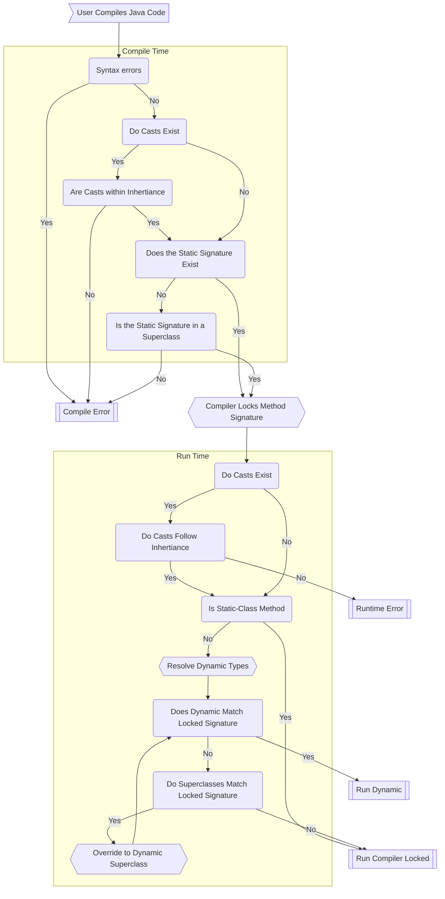

# CS61BL: Data Structures and Programming Methodology
##### By James Ding. Summer 2023. Midterm Date: July 14, 2023.

# Java

Java is unique in that everything must be encapsulated in either a Class or Interface.
	
### Remember, in Java:
- When instantiating a new Object, the new keyword must be used. 
- When an method returns nothing, the function return type is void

# Data Structures and Use Cases
## Arrays
The native way to store any type of data in an object, with a 0-index and immutable size.
> **Note:** To access the size of the array, use array.length
## ArrayList<T>
ArrayLists are basically dynamic arrays, in that the size is mutable. This means you can increase the size (by adding elements) without having to copy an Array
Under the hood, ArrayList will automatically resize Arrays once they reach hit their size limit, or when the usage ratio is too low (to save memory)
> **Note**: To Access the size of the ArrayList, use size()
## Queues and Stacks
Queues are like a line. You can only add to the back, and only retrieve in the front
Stacks are like a stack of plates. People can only add more plates, and remote plates from the top
## Trees
### Binary Trees
A bushy binary tree is a tree that is perfectly balanced, in other words, each non-leaf node must have a left and right node. The opposite of this is called a spindly tree
### Binary Search Trees (BSTs)
A specific type of binary tree, where the left child must be smaller than the current key, and the right child must be larger than the current child

When finding an element in a BST, check whether the node value is equal, otherwise go to the proper subtree depending on the requested item. If node is null, the node value does not exist
When inserting a new element into a BST, the important aspect is that we are assigning the sub child a new tree, which is the recursive call. The base case is when null, return a new node which will be inserted
When deleting a node, you want to find the smallest child of the right subtree (successor) or largest child of the left subtree (predecessor)
## Traversals
The following traversals will apply for Binary Trees
### Depth First Search (DFS)
Depth First Searches have a recursive nature, in which the item and children (branches) are accessed in any arbitrary order.
An iterative traversal should contain a data structure such as a Stack
#### Pre Order, In Order, and Post Order
- Pre: When the item is accessed first, then the left child, and finally the right child
- In: When the left child is accessed first, then the item, and finally the right child
- Post: When the left child is accessed first, then the right child, finally the item

**A special thing about traversing in-order BST will result in the original sorted order.**

Breadth First Search (BFS)
For each layer, go left to right.
## Dynamic Method Selection
### Method Selection Process
The diagram below should help you understand the process of method selection. The process is as follows:

It is to be noted that Casting only affects the static type. The cast will become ineffective during runtime

## Asymptotic Analysis
Analyzing the runtime of any function, as some arbitrary N increases in size.

> Fun Fact: Computers can't actually solve this problem - see Halting Problem

Arithmetic Sums: `1+2+3+4+f(N)=(f(N)2)`

Geometric Sum: `1+2+4+8+f(N)=(f(N))`

Recursive Last Layer Work: `B^W`, where B is the branching factor and W is the

For anything equal to or below (2N-1), you can drop constants for it to become (2N). However, for anything equal to or bigger than (NN), constants within the exponent have a significant role
### Notations
The most popular form to describe a runtime of a function is Big-O notation, represented by O(),  being any function (listed below) that describes the general runtime of the function. Drop any constants (including the base of log - change of base reveals its actually a constant)

`1 < log(N) < N < N log(N) < N^2 < N^C < C^N < N^N < N!`
#### Big Omega
When it comes to Big Omega, you can think of it is a > sign.

Formal Definition: R(N)(f(N)) if and only if there exists a positive constant k1 such that R(N)k1f(N) for all N greater than some N0 (a very large N
#### Big O
When it comes to Big O, you can think of it as a < sign.
Format Definition: R(N)O(f(N)) if and only if there exists a positive constant k2 such that R(N)k2f(N) for all N greater than some N0 (a very large N)

#### Big Theta
Exists if and only if the tightest Big Omega and Big O bound are equal (aka bounded by the same family of functions)