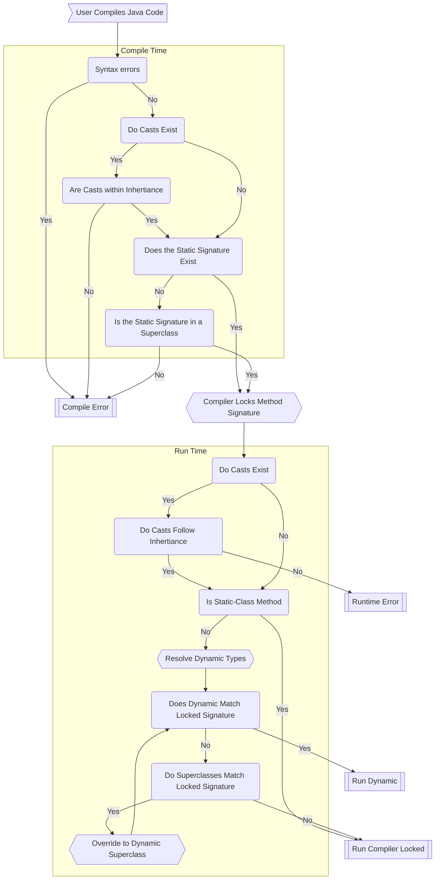

# Dynamic Method Selection
Dynamic method selection is the process by which a method is selected for execution at runtime based on the actual type 
of object it's called on.

This is sometimes different from than the type it's presented as during compile-time, which makes things a little 
tricky.

## Compile Time Selection

### Compilers
Let's take a step back and understand the role of a compiler.

A compiler is a computer program that takes code written in one programming language (the source code) and translates it
into another language, typically machine code, which can be executed directly by a computer's hardware. This translation
process allows the computer to understand and run the program. The compiled code is often saved as an executable file, 
which can be run any number of times without needing to be compiled again.

!!! question "Where do Syntax Errors come from?"
    During compilation (the process of compiling code), the compiler checks that all your code makes sense. Therefore,
    syntax errors or illegal references can be picked up by our compiler, and thrown as a compilation error.

??? tip "Compiler Analogy"
    Imagine you've written a detailed recipe for a new dish you've created. You wrote it in your unique style, with shorthand notes and special symbols that only you and a few friends understand. But for a wider audience, like an international cookbook, you'd need this recipe to be in a format that many people around the world can read and understand.

    A compiler in programming is a bit like a translator for your special recipe. When you write a program (or the "recipe" in our analogy), you're often writing it in a high-level language that's easier for humans to read and write. But computers don't understand this high-level language directly; they understand a much simpler and more primitive language (machine code).

    So, a compiler takes your high-level program and translates (or "compiles") it into the low-level machine code that the computer can understand and execute. Just like converting your unique recipe into a format suitable for an international cookbook.

    This process ensures that you can write programs in a more human-friendly manner, while still allowing the computer to understand and run them.

### Cast Validity
If casts exist in our Java code, we need to make sure it's a valid cast within the [inheritance tree]

## Summary

