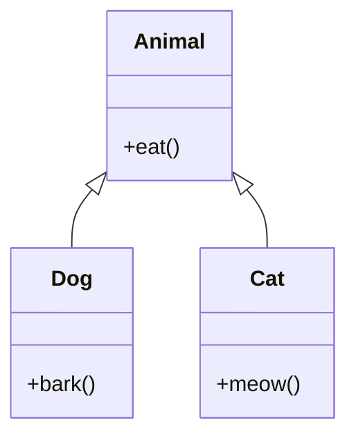

# Inheritance
In programming, especially in Java, inheritance is a mechanism where a new class derives or "inherits" properties and
behaviors (methods) from an existing class. The primary advantage is that it promotes code reusability and establishes a
relationship between the parent and child classes.

## Super and Subclasses
```java
class Animal {
    void eat() {
        System.out.println("This animal eats food.");
    }
}

class Dog extends Animal {
    void bark() {
        System.out.println("The dog barks.");
    }
}
```

Notice how we generalize the behavior of an animal (in this case, just eating) in the `Animal` class.
We then extend this class to create a `Dog` class, which inherits the `eat()` method from the `Animal` class, but also
has its own `bark()` method.

```java
Dog fido = new Dog();
fido.eat(); // This animal eats food.
fido.bark(); // The dog barks.
```

The superclass is the class being inherited from, and the subclass is the class that inherits from the superclass.
In this case, `Animal` is the superclass, and `Dog` is the subclass.

## Sibling Classes
We can also create a `Cat` class, which also inherits the `eat()` method from the `Animal` class, but has its own
`meow()` method.

```java
class Cat extends Animal {
    void meow() {
        System.out.println("The cat meows.");
    }
}
```

```java
Cat whiskers = new Cat();
whiskers.eat(); // This animal eats food.
whiskers.meow(); // The cat meows.
```

In this case, `Dog` and `Cat` are sibling classes, as they both inherit from the same parent class, `Animal`.

??? question "Can we say that Dog extends Cat or vice versa?"
    No, we cannot. Inheritance is a parent-child relationship, not a sibling relationship.

??? question "Can we have multiple superclasses?"
    No, we cannot. Java does not allow classes to inherit from multiple superclasses.

## Inheritance Rules

### Access Modifiers
When inheriting from a superclass, the subclass can only access the superclass' public and protected members.

This means that all private members are not accessible to the subclass.

!!! example
    If we modify the `Animal` class to have a private `sleep()` method, we cannot access it from the `Dog` class.

### Constructor Inheritance
In Java, constructors are unique in that they are not members in the traditional sense and therefore cannot be 
"inherited" as methods or attributes are. However, constructors play a role in the inheritance hierarchy through the 
mechanism of constructor chaining. Here's how it works:

#### Constructor Chaining
When you create an instance of a derived class, its constructor is responsible for calling the constructor of its 
immediate parent class. This is done using the `super` keyword.

The constructor of the base class is always executed before the derived class's constructor. If you don't explicitly
call a parent's constructor, Java will automatically call the no-argument constructor of the parent class.

=== "Implicit"
    When a child class does not provide any explicit call to the base class constructor, the compiler automatically inserts
    a call to the no-argument constructor of the base class using `super()`.

    ```java
    class Parent {
        Parent() {
            System.out.println("Parent Class Constructor");
        }
    }

    class Child extends Parent {
        Child() {
            System.out.println("Child Class Constructor");
        }
    }

    public class Main {
        public static void main(String[] args) {
            Child child = new Child();  
            
            /* Output:
            Parent Class Constructor
            Child Class Constructor
            */
        }
    }
    ```

=== "Explicit"
    If the base class does not have a no-argument constructor, or if you want to call a different constructor of the base
    class, you need to explicitly use super with arguments.

    ```java
    class Parent {
        Parent(int x) {
            System.out.println("Parent Class Constructor with value " + x);
        }
    }

    class Child extends Parent {
        Child() {
            super(42);  // Explicit call to Parent's constructor
            System.out.println("Child Class Constructor");
        }
    }

    public class Main {
        public static void main(String[] args) {
            Child child = new Child();         
            
            /* Output:
            Parent Class Constructor with value 42
            Child Class Constructor
            */
        }
    }
    ```

!!! abstract "Takeaways"
    - A call to `super()` (whether implicit or explicit) must always be the first statement in the derived class's constructor.
    - If the parent has no default (no-argument) constructor, the child class must explicitly call a parent constructor using `super(...)`.
    - A derived class can't inherit a parent's constructor in the traditional sense, but it does have to ensure that one of the parent's constructors is called when an object of the derived class is instantiated.

??? question "Concept Check"
    Consider the following code. Then answer the questions below.
    ```java
    class Grandparent {
        Grandparent() {
            System.out.println("hi gramps!");
        }

        Grandparent(int x) {
            System.out.println("woah gramps is: " + x);
        }
    }

    class Parent extends Grandparent {
        Parent() {
            System.out.println("gramps child.");
        }

        Parent(int y) {
            this();
            System.out.println("gramps child is: " + y);
        }
    }

    class Child extends Parent {
        Child() {
            super(50);
            System.out.println("grandchild");
        }
    }

    class FamilyTree {
        public static void main(String[] args) {
            new Child();
        }
    }
    ```

    **Part 1:** Is this valid Java?

    - [ ] The code compiles and runs without error.
    - [ ] The code compiles but throws an exception at runtime.
    - [ ] The code does not compile.

    **Part 2:** Select the output of the program, in order (if applicable).

    - [ ] hi gramps!
    - [ ] woah gramps is: 50
    - [ ] gramps child.
    - [ ] gramps child is: 50
    - [ ] grandchild
    - [ ] grandchild is: 50

??? success "Concept Check Solution"

    The solution for **Part 1**

    - [x] The code compiles and runs without error.
    - [ ] The code compiles but throws an exception at runtime.
    - [ ] The code does not compile. 

    ??? question "Wait hold up... what's `this()` then?"
        In this case, `this()` calls the no-arg constructor of the **current** class. This resolves to calling the 
        no-argument constructor of `Parent`, so it's actually completely valid.

    The solution for **Part 2**

    - [x] hi gramps!
    - [ ] woah gramps is: 50
    - [x] gramps child.
    - [x] gramps child is: 50
    - [x] grandchild
    - [ ] grandchild is: 50 

    Let's break this down.

    1. We start by instantiating our `Child` object. This calls the `Child` constructor.
    2. The `Child` constructor begins with a call to `super(50)`, which just calls `Parent(int y)`, as `Child` 
    extends `Parent`.
        1. `Parent(int y)` calls `this()`, which resolves to `Parent()`, as `Parent` extends `Grandparent`.
            1. `Parent()` implicitly calls `super()`, which calls `Grandparent()`.
                1. `Grandparent()` prints `hi gramps!`. This is the first line of output.
            1. `Parent()` prints `gramps child.`. This is the second line of output.
        1. `Parent(int y)` prints `gramps child is: 50`. This is the third line of output.
    3. `Child`'s constructor prints `grandchild`. This is the fourth line of output.
    
### Method Overriding
If a child class has a method with the same name as a method in the parent class, it is known as method overriding. 
The method in the child class should have the same name, return type, and parameters as the one in the parent class.

This will be covered in more detail in [Dynamic Method Selection](./dynamic-method-selection.md).

### Method Overloading
If a class has multiple methods with the same name but different parameters, it is known as method overloading.
Specifically, the methods can have the same name while maintaining different function signatures.

!!! example
    Let's say we have a class `Calculator` with a method `add` that takes two `int`s and returns an `int`.
    ```java
    class Calculator {
        int add(int a, int b) {
            return a + b;
        }
    }
    ```
    We can overload the `add` method to take two `double`s and return a `double`.
    ```java
    class Calculator {
        int add(int a, int b) {
            return a + b;
        }

        double add(double a, double b) {
            return a + b;
        }
    }
    ```
    Note that the bodies of the function don't have to be the same.

??? question "By changing the return type, does this count as method overloading?"
    No. Method overloading is only when the method name and parameters are the same.

    
## Inheritance Trees
We can visualize the relationship between classes using inheritance trees. It's similar to the concept of a family tree,
where the parent class is the parent, and the child classes are the children.



When we say that a class is a part of an inheritance tree, we mean the inheritance tree contains that class. For example,
`Dog` is apart of the inheritance tree above, but `Bird` is not.

Remember how inheritance lets one class (child class) "inherit" properties and methods from another class (parent class)? It's great for establishing an "is-a" relationship. For example, a Dog is an Animal.

But what if we have behaviors that can be shared across classes that don't fit into a strict "is-a" relationship? For instance, both Bird and Airplane can fly, but it doesn't make sense to say an Airplane is a Bird or vice versa.

This is where interfaces come into play!

## Interfaces
An interface is a blueprint of methods. Unlike classes, interfaces can't have any actual implementation of methods - they can only provide method declarations. This means when a class "implements" an interface, it promises to provide the actual behavior (implementation) for those methods.

```java 
// Interface declaration
interface Flyable {
    void fly();
}

// Bird class implementing Flyable interface
class Bird implements Flyable {
    @Override
    public void fly() {
        System.out.println("Bird flaps its wings to fly.");
    }
}

// Airplane class implementing Flyable interface
class Airplane implements Flyable {
    @Override
    public void fly() {
        System.out.println("Airplane uses engines to fly.");
    }
}

```

Because both Bird and Airplane are flyable, so they implement the Flyable interface and provide their unique
implementation of the `fly()` method.

But what real benefit does this provide? Well, let's say we want all of our flyable objects to take off. 
```java
List<Flyable> takeoffRoster = new ArrayList<>();

// Add some birds and airplanes to the list
takeoffRoster.add(new Bird());
takeoffRoster.add(new Airplane());

// Take off!
for (Flyable flyable : takeoffRoster) {
    flyable.fly();
}
```

Without interfaces, we would have to have two lists - one for birds and one for airplanes. But with interfaces, we can
generalize the behavior of flying and treat all flyable objects the same.

??? question "Can you have a class that implements multiple interfaces?"
    Yes, you can! A class can implement multiple interfaces, but it can only extend one class.

!!! abstract "Takeaways"
    - Interfaces give flexibility, as it ensures that certain classes adhere to a certain "contract" without dictating how that behavior is achieved.
    - Abstraction: It offers another level of abstraction, helping you segregate what a class should do (interface) from how it achieves doing it (class implementation).

## Abstract Classes
If we think of regular classes as blueprints for creating objects and interfaces as contracts that certain classes must adhere to, then abstract classes fall somewhere in between.

An abstract class is a class that cannot be instantiated on its own and requires subclasses to provide implementations for its abstract methods. In essence, it's "incomplete" on its own.

### Features of Abstract Classes
- You can't create an instance of an abstract class using the new keyword directly.
- Abstract classes can have both fully implemented methods (like a regular class) and abstract methods (which have no body, similar to interface methods).
- You can 

Let's use abstract classes to model relationships between vehicles.
```java 
// Abstract class declaration
abstract class Vehicle {
    // An abstract method: No implementation here!
    abstract void move();

    // A regular method: With implementation.
    void fuelUp() {
        System.out.println("The vehicle is fueled up!");
    }
}

// A subclass implementing the abstract method
class Car extends Vehicle {
    @Override
    void move() {
        System.out.println("The car moves on four wheels.");
    }
}

// Another subclass implementing the abstract method
class Boat extends Vehicle {
    @Override
    void move() {
        System.out.println("The boat sails on water.");
    }
}
```

Here, every Vehicle can fuel up, but the way each vehicle moves is different and specific to the subclass.
We can still override the `fuelUp()` method in the subclass if we want to.

```java
class Tesla extends Car {
    @Override
    void fuelUp() {
        System.out.println("The Tesla is charged up!");
    }
}
```

!!! abstract "Takeaways"
    - If multiple subclasses should implement some methods in the same way (shared behavior), this common implementation
    can be provided in the abstract class itself.
    - Like interfaces, any class that extends an abstract class is forced to implement its abstract methods. This 
    ensures a certain structure among subclasses.
    - Unlike interfaces, abstract classes can have member variables that are not public, static, and final, allowing for 
    more flexible data storage capabilities.
    - Abstract classes can have constructors, even though they can't be instantiated! This is useful because a subclass 
    can call this constructor to set up initial state or perform validations.
