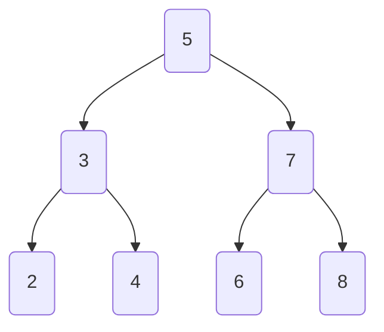

# Binary Search Trees (BSTs)

A binary search tree is a type of binary tree which follows the [BST Property](#bst-property).

## BST Property

For every node $N$ in a BST, the following conditions are true:

- Every item in $N$'s left subtree is less than $N$.
- Every item in $N$'s right subtree is greater than $N$.



!!! tip
    Within CS61BL, BSTs will have unique keys. Therefore, given keys $K_1$ and $K_2$, $K_1 < K_2$ or $K_1 > K_2$.

    Consequently, given $K_3$, if $K_3 < K_1$, then $K_3$ must be in $K_1$'s left subtree. If $K_3 > K_1$, then $K_3$ must be in $K_1$'s right subtree. (assuming $K_1$ is the parent)

    The transitive property of inequality can be used to extend this to any node in the tree.

## Searching
In order to search for a key $K$ in a BST, we can use the BST property to our advantage.

In Python, we can implement this as follows:

```python
def search(root, key):
    if root is None or root.key == key:
        return root
    if root.key < key:
        return search(root.right, key)
    return search(root.left, key)
```

### Time Complexity
The time complexity of searching for a key $K$ of size $N$ in a BST is $\Theta(\log N)$ in the best case, and $\Theta(N)$ in the worst case.

#### Best Case
The best case occurs when the tree is bushy, or balanced. This means that for each node, there are roughly the same number of nodes in the left and right subtrees. This produces a tree with $\log N$ levels, where $N$ is the number of nodes in the tree.

!!! example
    ```mermaid
    graph TD
        A(5) --> B(3)
        A --> C(7)
        B --> D(2)
        B --> E(4)
        C --> F(6)
        C --> G(8)
    ```

#### Worst Case
Conversely, the worst case occurs when the tree is "spindly", or unbalanced. This means that for each node, there are many more nodes in one subtree than the other. This produces a tree with $N$ levels, where $N$ is the number of nodes in the tree.

!!! example
    ```mermaid
    graph LR
        A(1) --> B(2)
        B --> C(3)
        C --> D(4)
    ```
    This depiction of the "tree" essentially represents a linked list, which has a time complexity of $\Theta(N)$.

## Insertion
In order to insert a key $K$ into a BST, we can use the BST property to our advantage, similar to searching.

In Python, we can implement this as follows:

```python
def insert(root, key):
    if root is None:
        return Node(key)
    if root.key < key:
        root.right = insert(root.right, key)
    else:
        root.left = insert(root.left, key)
    return root
```
We essentially search for the key $K$ in the tree, which is when we reach a `None` node. Note that the parent of this node is the node that we want to insert $K$ into.
We then create a new node with key $K$ and return it.

## Deletion
Deletion is slightly more tricky than insertion and searching, as we need to consider the following cases:

### Deletion of a Leaf
If the node to be deleted is a leaf, we can simply delete it, as it has no "dependants".

### Deletion of a Node with One Child
If the node $K$ to be deleted has one child, we can simply replace $K$ with its child. In essence, we are "promoting" the child to take the place of $K$.

### Deletion of a Node with Two Children (Hibbard Deletion)
If the node $K$ to be deleted has two children, we need to find the successor of such that [BST Property](#bst-property) is maintained.

The successor of node $K$ is the greatest leaf in $K$'s left subtree or the smallest leaf in $K$'s right subtree.

After a successor is found, the successor is swapped with $K$, and $K$ is deleted.
