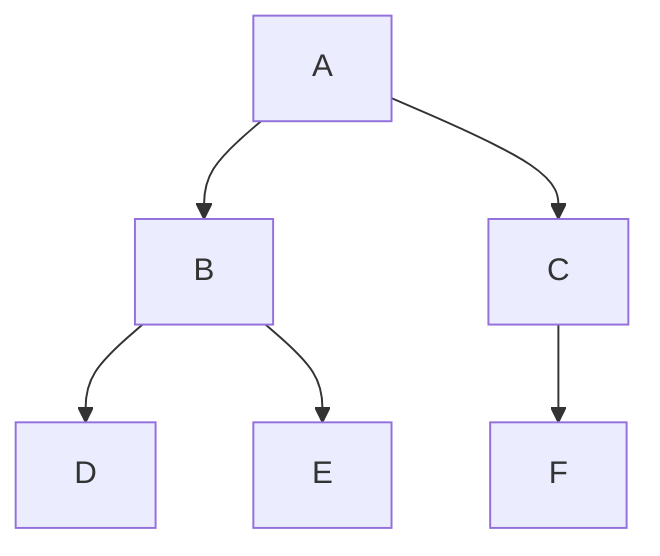

# Binary Trees
Binary trees are a specific type of rooted trees where each node has at most two children (subtrees).

## Conditions for Binary Trees

- Every node $N$ in a binary tree has exactly one parent.
- Every node $N$ in a binary tree has at most two children, but can have 0.

!!! tip
    Binary trees are depicted as "upside-down" trees, with the root at the top and leaves on the bottom.

